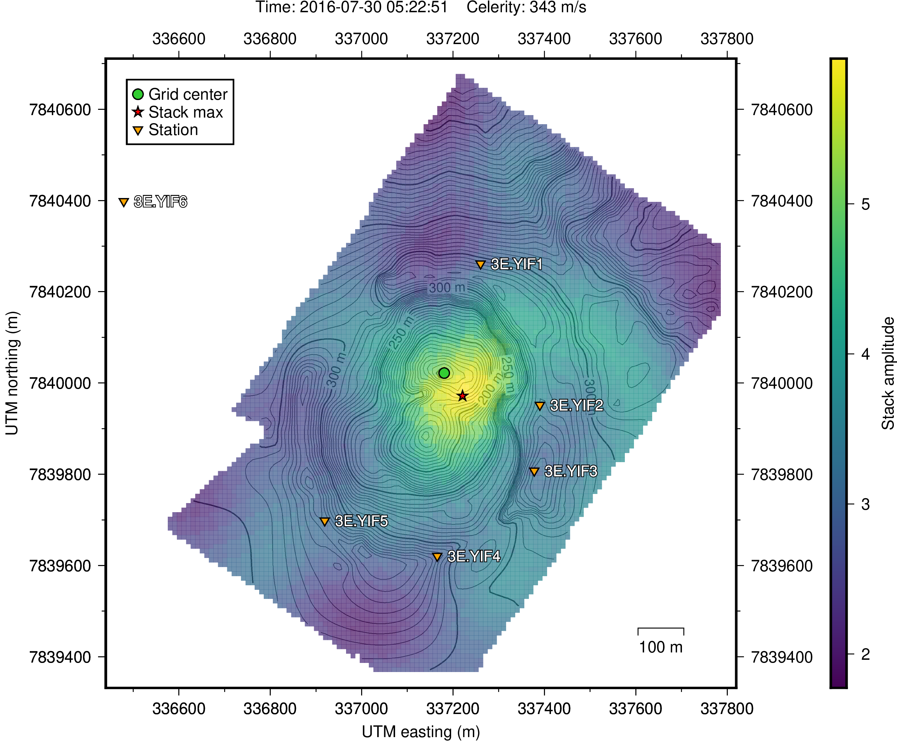

rtm
===

[](https://uaf-rtm.readthedocs.io/en/pygmt/)

_rtm_ is a Python package for locating infrasound sources using reverse time
migration (RTM). Infrasound (or seismic) waveform data are back-projected over
a grid of trial source locations. Based upon previous work by Sanderson et al.
(in press) and Walker et al. (2010), this implementation is flexible and
applicable to a wide variety of network geometries and sizes. Realistic travel
times can be incorporated from numerical modeling or atmospheric
specifications.



**References**

Sanderson, R., Matoza, R. S., Fee, D., Haney, M. M., & Lyons, J. J. (in press).
Remote detection and location of explosive volcanism in Alaska with the
EarthScope Transportable Array. _Journal of Geophysical Research: Solid Earth_.
[https://doi.org/10.1029/2019JB018347](https://doi.org/10.1029/2019JB018347)

Walker, K. T., Hedlin, M. A. H., de Groot‐Hedlin, C., Vergoz, J., Le Pichon,
A., & Drob, D. P. (2010). Source location of the 19 February 2008 Oregon bolide
using seismic networks and infrasound arrays. _Journal of Geophysical Research:
Solid Earth_, 115, B12329.
[https://doi.org/10.1029/2010JB007863](https://doi.org/10.1029/2010JB007863)

Installation
------------

It's recommended that you install this package into a new
[conda](https://docs.conda.io/projects/conda/en/latest/index.html) environment
containing all of the packages listed in the [Dependencies](#dependencies)
section.

To create a new conda environment for use with _rtm_, execute the following
terminal command:
```
$ conda create -n rtm -c conda-forge gdal obspy utm xarray
```
This creates a new environment called `rtm` with all **almost all** _rtm_
dependencies installed (see below). In addition to published packages, _rtm_
requires the
[_waveform_collection_](https://github.com/uafgeotools/waveform_collection)
package.

To install _rtm_, first activate the `rtm` environment with
```
$ conda activate rtm
```
and install the dependency _waveform_collection_ into this environment
(instructions
[here](https://github.com/uafgeotools/waveform_collection#installation)).

Then install GMT 6 and PyGMT — installation instructions are
[here](https://github.com/GenericMappingTools/gmt/blob/master/INSTALL.md/)
and
[here](https://www.pygmt.org/dev/install.html), respectively. Finally, execute
the following terminal commands:
```
$ git clone https://github.com/uafgeotools/rtm.git
$ cd rtm
$ pip install -e .
```
The final command installs the package in "editable" mode, which means that you
can update it with a simple `git pull` in your local repository. This install
command only needs to be run once.

Dependencies
------------

_uafgeotools_ repositories:

* [_waveform_collection_](https://github.com/uafgeotools/waveform_collection)

Python packages:

* [GDAL](https://gdal.org/)
* [ObsPy](http://docs.obspy.org/)
* [utm](https://github.com/Turbo87/utm)
* [xarray](http://xarray.pydata.org/en/stable/)

...and their dependencies, which you don't really have to be concerned about if
you're using conda!

Other:

* [GMT 6](https://docs.generic-mapping-tools.org/latest/)
* [PyGMT](https://www.pygmt.org/)

Usage
-----

Documentation is available online
[here](https://uaf-rtm.readthedocs.io/en/pygmt/).

Access the package's functions with (for example)
```python
from waveform_collection import gather_waveforms
from rtm import define_grid
```
and so on. For usage examples, see
[`example_regional.py`](https://github.com/uafgeotools/rtm/blob/pygmt/example_regional.py)
or
[`example_local.py`](https://github.com/uafgeotools/rtm/blob/pygmt/example_local.py).

Authors
-------

(_Alphabetical order by last name._)

David Fee<br>
Liam Toney
