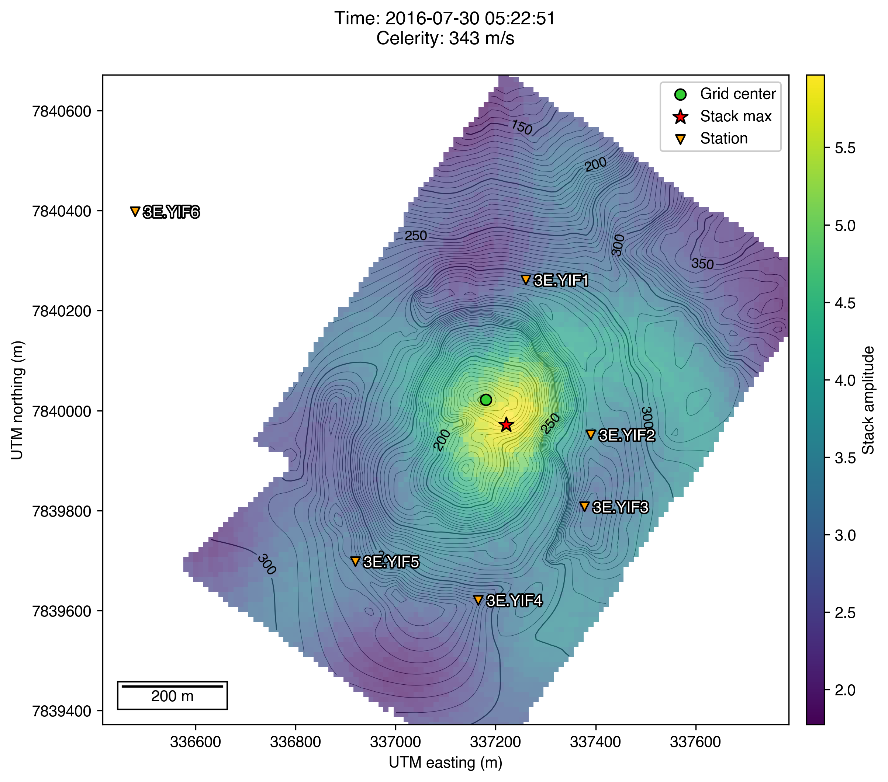

rtm
===

[](https://uaf-rtm.readthedocs.io/en/master/)

_rtm_ is a Python package for locating infrasound sources using reverse time
migration (RTM). Infrasound (or seismic) waveform data are back-projected over
a grid of trial source locations. Based upon previous work by Sanderson et al.
(2020) and Walker et al. (2010), this implementation is flexible and
applicable to a wide variety of network geometries and sizes. Realistic travel
times can be incorporated from numerical modeling or atmospheric
specifications.



**References**

Sanderson, R. W., Matoza, R. S., Fee, D., Haney, M. M., & Lyons, J. J. (2020).
Remote detection and location of explosive volcanism in Alaska with the
EarthScope Transportable Array. _Journal of Geophysical Research: Solid Earth_,
125, e2019JB018347.
[https://doi.org/10.1029/2019JB018347](https://doi.org/10.1029/2019JB018347)

Walker, K. T., Hedlin, M. A. H., de Groot‐Hedlin, C., Vergoz, J., Le Pichon,
A., & Drob, D. P. (2010). Source location of the 19 February 2008 Oregon bolide
using seismic networks and infrasound arrays. _Journal of Geophysical Research:
Solid Earth_, 115, B12329.
[https://doi.org/10.1029/2010JB007863](https://doi.org/10.1029/2010JB007863)

Installation
------------

We recommend you install this package into a new
[conda](https://docs.conda.io/projects/conda/en/latest/index.html) environment.
(Please install [Anaconda](https://www.anaconda.com/products/individual) or
[Miniconda](https://docs.conda.io/en/latest/miniconda.html) before proceeding.)
The environment must contain all of the packages listed in the
[Dependencies](#dependencies) section. For ease of installation, we've provided
an
[`environment.yml`](https://github.com/uafgeotools/rtm/blob/master/environment.yml)
file which specifies all of these dependencies as well as instructions for
installing _rtm_ itself. To install _rtm_ in this manner, execute the following
commands:
```
git clone https://github.com/uafgeotools/rtm.git
cd rtm
conda env create -f environment.yml
```
This creates a new conda environment named `rtm` and installs _rtm_ and all of
its dependencies there.

The final command above installs _rtm_ in "editable" mode, which means that you
can update it with a simple `git pull` in your local repository. We recommend
you do this often, since this code is still under rapid development.

Dependencies
------------

_uafgeotools_ repositories:

* [_waveform_collection_](https://github.com/uafgeotools/waveform_collection)

Python packages:

* [cartopy](https://scitools.org.uk/cartopy/docs/latest/)
* [GDAL](https://gdal.org/)
* [ObsPy](http://docs.obspy.org/)
* [utm](https://github.com/Turbo87/utm)
* [xarray](http://xarray.pydata.org/en/stable/)

...and their dependencies, which you don't really have to be concerned about if
you're using conda!

Optional (for automatic DEM downloading):

* [GMT 6](https://docs.generic-mapping-tools.org/latest/) (install by following
  the
  [official GMT install instructions](https://github.com/GenericMappingTools/gmt/blob/master/INSTALL.md/))

Usage
-----

Documentation is available online
[here](https://uaf-rtm.readthedocs.io/en/master/).

To use _rtm_, you must always first activate the `rtm` environment with:
```
conda activate rtm
```
Then, you may access the package's functions from the Python interpreter with
(for example)
```python
from waveform_collection import gather_waveforms
from rtm import define_grid
```
and so on. For usage examples, see
[`example_regional.py`](https://github.com/uafgeotools/rtm/blob/master/example_regional.py)
or
[`example_local.py`](https://github.com/uafgeotools/rtm/blob/master/example_local.py).

Authors
-------

(_Alphabetical order by last name._)

David Fee<br>
Liam Toney
